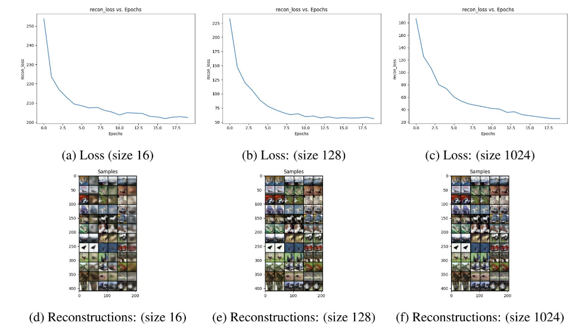

## Generative Models Implemented Pytorch
This repo includes From scratch Implementation of Various Generative Model, Highlighted as below:
1. Generative Adversarial Networks: CycleGAN, Pix2pix, LSGAN, WGAN,WGAN-GP, Vanilla GAN, patch Discriminator.
2. Variational Autoencoder: AE, VAE, Beta- VAE
3. Diffusion: End to End implmentation of DDPM(Stochastic) and DDIM (deterministic) Diffusion Models with Cosine and Linear Noise Schedule and 25 block (12 Encoder, 12 Decoder, 1 latent) Unet conditioned on Timesteps and Text.


## Dataset
CUB-200 Bird Species Dataset
The CUB-200 dataset, short for "Caltech-UCSD Birds-200," is a widely used benchmark dataset for fine-grained visual categorization and bird species recognition. This dataset is specifically designed for training and evaluating computer vision models on the task of identifying and classifying bird species from images.

## Software setup

Please use Python 3.8.

Run the following script to setup all dependencies:
```
chmod +x setup.sh
./setup.sh /path/to/python_env/lib/python3.8/site-packages # e.g. ./download_cub.sh ~/miniconda3/envs/gen_ai/lib/python3.8/site-packages

##  Directories

```
```
.
├── attributes.txt
├── cub_clean_custom_na.npz
├── data_gan
├── datasets
│   ├── CUB_200_2011
│   ├── CUB_200_2011_32
│   └── CUB_200_2011.tgz
├── diffusion
│   ├── data_ddim
│   ├── data_ddpm
│   ├── epoch_199.pth
│   ├── inference.py
│   ├── model.py
│   ├── __pycache__
│   ├── README.md
│   ├── unet.py
│   └── utils.py
├── gan
│   ├── attributes.txt
│   ├── data_gan
│   ├── data_ls_gan
│   ├── data_wgan_gp
│   ├── __init__.py
│   ├── LSGAN.py
│   ├── networks.py
│   ├── __pycache__
│   ├── README.md
│   ├── train.py
│   ├── utils.py
│   ├── Vanilla_Losses.py
│   └── WGAN.py
├── image-1.png
├── image-2.png
├── image-3.png
├── image-4.png
├── image-5.png
├── image.png
├── README.md
├── requirements.txt
├── resize_dataset.py
├── setup.sh
└── vae
    ├── data
    ├── model.py
    ├── __pycache__
    ├── README.md
    ├── train.py
    └── utils.py

```


## Results




